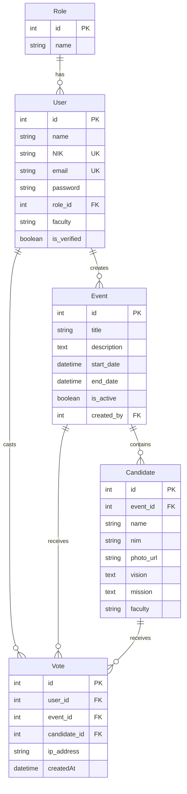
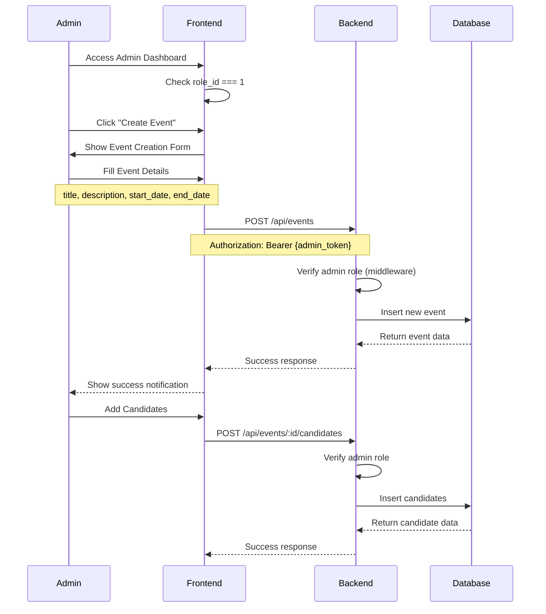
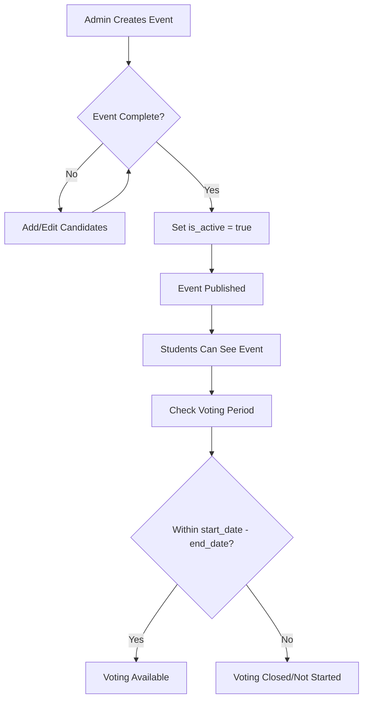
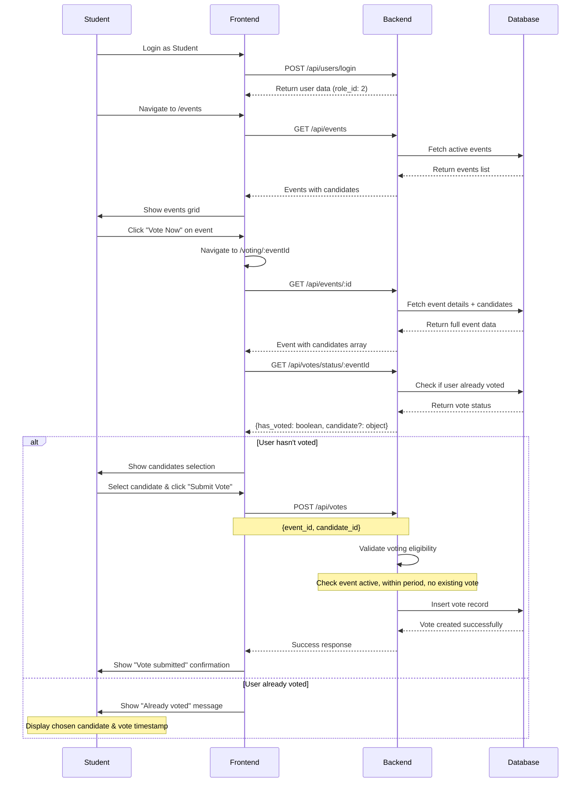
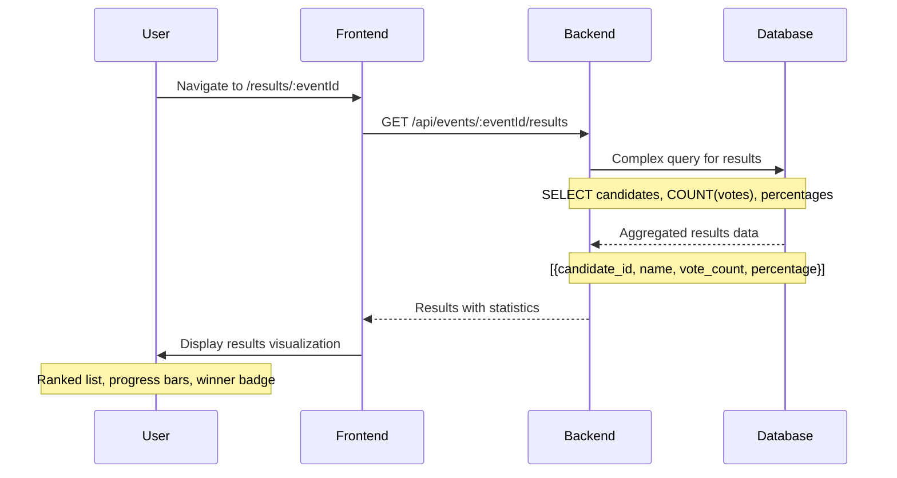

# VoteSecure Events - Complete Application Flow

## 🏗️ System Architecture Overview

VoteSecure is a digital voting platform with role-based access control, featuring a **Vue.js frontend** and **Express.js backend** with **PostgreSQL** database.

### Core Roles
- **Admin (role_id: 1)**: Create/manage events, candidates, and users
- **User/Student (role_id: 2)**: Participate in voting and view results

---

## 📊 Database Schema & Relationships



---

## 🔐 Authentication & Authorization Flow

### 1. User Authentication
```
┌─────────────────┐    ┌─────────────────┐    ┌─────────────────┐
│   Login Page    │───▶│  Backend Auth   │───▶│  JWT Token +    │
│                 │    │                 │    │  User Data      │
│ NIK + Password  │    │ Verify Password │    │  (includes role)│
└─────────────────┘    └─────────────────┘    └─────────────────┘
                                │
                                ▼
                    ┌─────────────────────────────────┐
                    │     Store in localStorage      │
                    │ { id, name, NIK, role_id,      │
                    │   token, faculty }             │
                    └─────────────────────────────────┘
```

### 2. Role-Based Route Protection
```
Frontend Router Guard:
├── Public Routes: /login, /register
├── Protected Routes (All authenticated users):
│   ├── /dashboard
│   ├── /events
│   ├── /voting/:eventId
│   └── /results/:eventId
└── Admin-Only Routes (role_id === 1):
    ├── /admin/events (manage events)
    ├── /admin/events/:id/candidates (manage candidates)
    └── /admin/users (manage users)

Backend Middleware:
├── authMiddleware: Verify JWT token
└── allowRoleId(1): Restrict to admin role
```

---

## 🗳️ Complete Events Flow

### Phase 1: Event Creation (Admin Only)



### Phase 2: Event Activation & Publishing



### Phase 3: Student Voting Process



### Phase 4: Results & Analytics



---

## 🔄 Real-time Updates & WebSocket Integration

### Current Implementation
- **Manual Refresh**: Users click refresh button to get latest results
- **Polling**: Frontend can implement periodic API calls for live updates

### Future Enhancement (WebSocket)
```
Event Voting WebSocket Flow:
┌─────────────────┐    ┌─────────────────┐    ┌─────────────────┐
│   Vote Cast     │───▶│  WebSocket      │───▶│  Broadcast to   │
│                 │    │  Server         │    │  All Clients    │
│ POST /votes     │    │                 │    │  Update Results │
└─────────────────┘    └─────────────────┘    └─────────────────┘
```

---

## 🛡️ Security Measures

### 1. Vote Integrity
```sql
-- Database Constraints
UNIQUE INDEX votes_user_event_unique ON votes (user_id, event_id);

-- Model Hook (Sequelize)
Vote.beforeCreate(async (vote) => {
  const existingVote = await Vote.findOne({
    where: { user_id: vote.user_id, event_id: vote.event_id }
  });
  if (existingVote) throw new Error("Already voted");
});
```

### 2. Voting Period Validation
```javascript
// Backend Controller Validation
const now = new Date();
if (now < event.start_date || now > event.end_date) {
  return res.status(400).json({
    message: "Voting is not open at this time"
  });
}
```

### 3. Role-Based API Protection
```javascript
// Admin-only routes
eventRouter.post("/", authMiddleware, allowRoleId(ADMIN_ROLE_ID), createEvent);
eventRouter.delete("/:id", authMiddleware, allowRoleId(ADMIN_ROLE_ID), deleteEvent);

// User routes (authenticated only)
voteRouter.post("/", authMiddleware, submitVote);
voteRouter.get("/history", authMiddleware, getUserVoteHistory);
```

---

## 📱 Frontend User Experience Flow

### Student Journey
```
1. Login Page
   ├── Enter NIK & Password
   └── Redirected to Dashboard

2. Dashboard
   ├── Welcome message
   ├── Active events summary
   └── Quick access to voting

3. Events List (/events)
   ├── Grid of available events
   ├── Event status (Active/Inactive)
   ├── Voting period indicators
   ├── Candidate previews
   └── Action buttons (Vote/View Results)

4. Voting Interface (/voting/:eventId)
   ├── Event details header
   ├── Voting period countdown
   ├── Candidates grid with photos
   ├── Vision & mission display
   ├── Selection mechanism
   └── Vote submission

5. Results Page (/results/:eventId)
   ├── Event summary
   ├── Ranked candidate results
   ├── Vote statistics
   ├── Progress bars & percentages
   └── Winner announcement
```

### Admin Journey
```
1. Admin Dashboard
   ├── System statistics
   ├── Recent activities
   └── Quick actions

2. Event Management
   ├── Events list with admin actions
   ├── Create new event form
   ├── Edit existing events
   └── Delete events (with confirmation)

3. Candidate Management
   ├── Add candidates to events
   ├── Upload candidate photos
   ├── Edit candidate information
   └── Remove candidates

4. User Management
   ├── View all registered users
   ├── Manage user roles
   ├── Verify user accounts
   └── Export user data

5. Analytics
   ├── Real-time vote counts
   ├── Participation rates
   ├── Event performance metrics
   └── Export results
```

---

## 🔧 API Endpoints Summary

### Public/Auth Endpoints
```
POST /api/users/login          # User authentication
POST /api/users/register       # User registration
POST /api/users/forgot-password # Password reset
```

### Student Accessible Endpoints
```
GET  /api/events              # List all events
GET  /api/events/:id          # Get event details + candidates
GET  /api/events/:id/results  # Get voting results
POST /api/votes               # Cast a vote
GET  /api/votes/status/:eventId # Check if user voted
GET  /api/votes/history       # User's voting history
```

### Admin-Only Endpoints
```
# Event Management
POST   /api/events                    # Create event
PUT    /api/events/:id                # Update event
DELETE /api/events/:id                # Delete event

# Candidate Management
POST   /api/events/:id/candidates                   # Add candidate
PUT    /api/events/:eventId/candidates/:candidateId # Update candidate
DELETE /api/events/:eventId/candidates/:candidateId # Delete candidate

# User Management
GET    /api/users                     # List all users
DELETE /api/users/:id                 # Delete user
```

---

## 🚀 Deployment & Environment

### Development Environment
```bash
# Backend (Port 3000)
cd server
pnpm run dev

# Frontend (Port 5173)
cd client
pnpm run dev
```

### Production Environment
```bash
# Build frontend
pnpm run build

# Start backend with PM2
pm2 start ecosystem.config.cjs
```

### Environment Variables
```env
# Backend (.env)
PORT=3000
DB_HOST=localhost
DB_NAME=votesecure_db
DB_USER=postgres
DB_PASS=password
JWT_SECRET=your_jwt_secret
ADMIN_ROLE_ID=1

# Frontend (.env)
VITE_API_DEVELOPMENT=http://localhost:3000
VITE_API_PRODUCTION=https://your-api-domain.com
```

---

## 📈 Performance & Scalability Considerations

### Current Architecture Strengths
- **Stateless Backend**: JWT-based authentication
- **Database Constraints**: Prevent data integrity issues
- **Role-Based Access**: Secure endpoint protection
- **Single Page Application**: Fast user interactions

### Scaling Recommendations
- **Database Indexing**: Add indexes on frequently queried columns
- **Caching**: Implement Redis for session management
- **CDN**: Serve static assets via CDN
- **Load Balancing**: Multiple backend instances
- **WebSocket Scaling**: Socket.io with Redis adapter

---

## 🧪 Testing Strategy

### Backend Testing
- Unit tests for controllers and models
- Integration tests for API endpoints
- Security testing for role-based access
- Database constraint testing

### Frontend Testing
- Component unit tests
- Role-based rendering tests
- E2E user journey tests
- Accessibility testing

### Manual Testing Scenarios
1. **Vote Integrity**: Attempt double voting
2. **Role Security**: Access admin routes as student
3. **Timing Validation**: Vote outside allowed period
4. **Data Validation**: Submit invalid form data
5. **Concurrent Voting**: Multiple users voting simultaneously

---

This comprehensive flow documentation covers the complete VoteSecure application from authentication to results display, including security measures and scalability considerations.